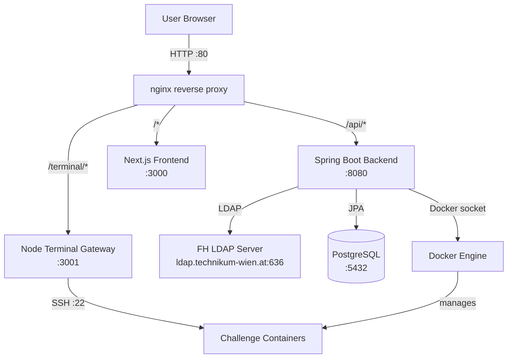
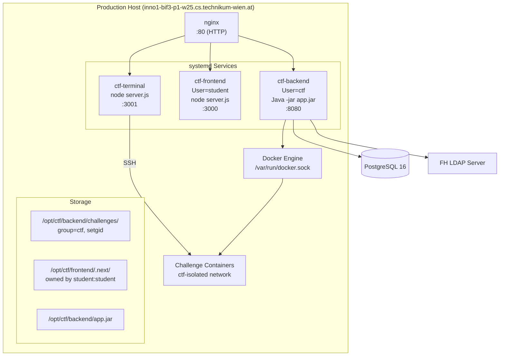
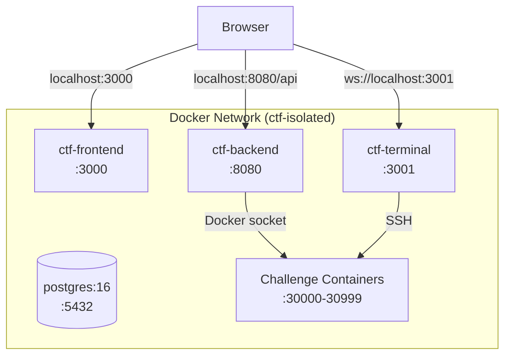

# Architecture Overview

## High-Level System Context

## Production Deployment View

## Docker Development Topology

## Component Communication Flows

| Flow | Source | Destination | Protocol | Purpose |
|------|--------|-------------|----------|---------|
| Authentication | Frontend → Backend → LDAP | Backend | REST + LDAPS | Login via FH university credentials |
| Challenge CRUD | Frontend | Backend | REST (JSON) | Create/read/update/delete challenges |
| File Download | Frontend | Backend | REST (binary) | Download challenge attachments |
| Instance Start | Frontend | Backend | REST | Start per-user Docker container |
| Container Mgmt | Backend | Docker Engine | Unix socket | Build/run/stop containers |
| Terminal Access | Frontend (xterm.js) | Terminal Gateway | WebSocket | Real-time SSH terminal |
| SSH Session | Terminal Gateway | Challenge Container | SSH | Interactive shell inside container |
| Flag Submission | Frontend | Backend | REST | Validate and record flag |
| Hints | Frontend | Backend | REST | Reveal hints with time-lock |
| Scoreboard | Frontend | Backend | REST | Leaderboard and statistics |

## Port Map

| Port | Service | Environment | Protocol |
|------|---------|-------------|----------|
| 80 | nginx | Production | HTTP (no HTTPS yet) |
| 3000 | Next.js frontend | Both | HTTP |
| 3001 | Terminal gateway | Both | HTTP / WebSocket |
| 8080 | Spring Boot backend | Both | HTTP (REST API) |
| 5432 | PostgreSQL | Both | PostgreSQL protocol |
| 30000-30999 | Challenge containers | Both | SSH (mapped host ports) |
| 636 | FH LDAP server | External | LDAPS |
