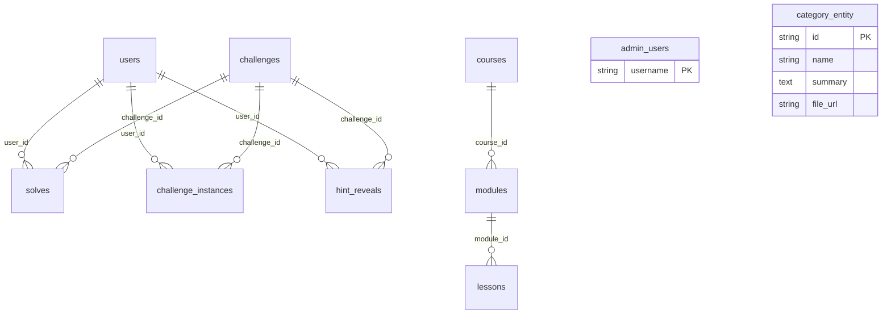

# Database Schema

**Engine:** PostgreSQL 16
**ORM:** Spring Data JPA / Hibernate (`ddl-auto=update`)
**Database name:** `ctf`

---

## Entity Relationship Diagram



---

## Tables

### users
Stores registered users, created on first LDAP login.

| Column | Type | Constraints | Notes |
|--------|------|-------------|-------|
| `id` | `BIGSERIAL` | PK | Auto-increment |
| `username` | `VARCHAR(100)` | NOT NULL, UNIQUE | FH student ID (e.g. if24b120) |
| `email` | `VARCHAR(255)` | | |
| `display_name` | `VARCHAR(255)` | | |
| `is_admin` | `BOOLEAN` | NOT NULL, DEFAULT false | |
| `is_active` | `BOOLEAN` | NOT NULL, DEFAULT true | |
| `last_login_at` | `TIMESTAMP` | | |
| `created_at` | `TIMESTAMP` | NOT NULL | @PrePersist |
| `updated_at` | `TIMESTAMP` | NOT NULL | @PrePersist/@PreUpdate |

### challenges
Challenge definitions — static flags or instance-based.

| Column | Type | Constraints | Notes |
|--------|------|-------------|-------|
| `id` | `VARCHAR(255)` | PK | Slug-timestamp, e.g. `web-101-1234567890` |
| `title` | `VARCHAR(255)` | | |
| `description` | `TEXT` | | |
| `category` | `VARCHAR(255)` | | e.g. web-exploitation, crypto |
| `difficulty` | `VARCHAR(255)` | | easy, medium, hard |
| `points` | `INTEGER` | | |
| `download_zip` | `BYTEA` | | Challenge file binary |
| `original_filename` | `VARCHAR(255)` | | |
| `requires_instance` | `BOOLEAN` | DEFAULT false | Dynamic container-based challenge |
| `flag` | `VARCHAR(255)` | | Static flag (for non-instance challenges) |
| `docker_files_json` | `TEXT` | | JSON blob of Dockerfile metadata |
| `challenge_folder_path` | `VARCHAR(500)` | | Filesystem path |
| `hints_json` | `TEXT` | | JSON array of hint strings |

### solves
Tracks challenge completions.

| Column | Type | Constraints | Notes |
|--------|------|-------------|-------|
| `id` | `BIGSERIAL` | PK | |
| `username` | `VARCHAR(255)` | NOT NULL | |
| `user_id` | `BIGINT` | FK → users.id | |
| `challenge_id` | `VARCHAR(255)` | NOT NULL, FK → challenges.id | |
| `points_earned` | `INTEGER` | DEFAULT 0 | May be reduced by hint penalties |
| `solved_at` | `TIMESTAMP` | DEFAULT NOW() | @CreationTimestamp |

**Unique constraint:** `(username, challenge_id)` — one solve per user per challenge.

### challenge_instances
Per-user Docker challenge container records.

| Column | Type | Constraints | Notes |
|--------|------|-------------|-------|
| `instance_id` | `VARCHAR(255)` | PK | UUID string |
| `username` | `VARCHAR(255)` | | |
| `user_id` | `BIGINT` | FK → users.id | |
| `challenge_id` | `VARCHAR(255)` | | |
| `container_name` | `VARCHAR(255)` | | Docker container name |
| `flag_hash` | `VARCHAR(255)` | | SHA-256 hash of per-user flag |
| `ssh_port` | `INTEGER` | | Mapped host port (30000-30999) |
| `status` | `VARCHAR(50)` | | RUNNING, STOPPED, EXPIRED |
| `created_at` | `TIMESTAMP` | | |
| `expires_at` | `TIMESTAMP` | | 1 hour after creation |

### hint_reveals
Tracks per-user hint reveals for time-lock enforcement.

| Column | Type | Constraints | Notes |
|--------|------|-------------|-------|
| `id` | `BIGSERIAL` | PK | |
| `username` | `VARCHAR(255)` | NOT NULL | |
| `user_id` | `BIGINT` | FK → users.id | |
| `challenge_id` | `VARCHAR(255)` | NOT NULL, FK → challenges.id | |
| `hint_index` | `INTEGER` | NOT NULL | 0-based |
| `revealed_at` | `TIMESTAMP` | DEFAULT NOW() | @CreationTimestamp |

**Unique constraint:** `(username, challenge_id, hint_index)` — one reveal per hint per user.

### admin_users
Admin whitelist — usernames in this table have ADMIN role.

| Column | Type | Constraints |
|--------|------|-------------|
| `username` | `VARCHAR(100)` | PK |

### categories
Challenge categories with theory content.

| Column | Type | Constraints |
|--------|------|-------------|
| `id` | `VARCHAR(100)` | PK |
| `name` | `VARCHAR(2000)` | NOT NULL |
| `summary` | `TEXT` | HTML content |
| `file_url` | `VARCHAR(2000)` | |

### courses
Educational course container.

| Column | Type | Constraints | Notes |
|--------|------|-------------|-------|
| `id` | `BIGSERIAL` | PK | |
| `title` | `VARCHAR(200)` | NOT NULL | |
| `description` | `VARCHAR(2000)` | | |
| `slug` | `VARCHAR(200)` | UNIQUE | URL-friendly identifier |
| `difficulty` | `VARCHAR(50)` | | beginner, intermediate, advanced |
| `estimated_minutes` | `INTEGER` | | |
| `order_index` | `INTEGER` | NOT NULL, DEFAULT 0 | Display ordering |
| `is_published` | `BOOLEAN` | NOT NULL, DEFAULT false | |
| `created_at` | `TIMESTAMP` | NOT NULL | |
| `updated_at` | `TIMESTAMP` | NOT NULL | |

### modules
Course modules, each containing lessons.

| Column | Type | Constraints | Notes |
|--------|------|-------------|-------|
| `id` | `BIGSERIAL` | PK | |
| `course_id` | `BIGINT` | NOT NULL, FK → courses.id | |
| `title` | `VARCHAR(200)` | NOT NULL | |
| `content` | `TEXT` | | Module overview |
| `order_index` | `INTEGER` | NOT NULL, DEFAULT 0 | |
| `created_at` | `TIMESTAMP` | NOT NULL | |
| `updated_at` | `TIMESTAMP` | NOT NULL | |

### lessons
Individual lesson content with code examples.

| Column | Type | Constraints | Notes |
|--------|------|-------------|-------|
| `id` | `BIGSERIAL` | PK | |
| `module_id` | `BIGINT` | NOT NULL, FK → modules.id | |
| `title` | `VARCHAR(200)` | NOT NULL | |
| `content` | `TEXT` | | Lesson body (HTML) |
| `detailed_explanation` | `TEXT` | | In-depth analysis |
| `video_url` | `VARCHAR(500)` | | Optional video link |
| `order_index` | `INTEGER` | NOT NULL, DEFAULT 0 | |
| `created_at` | `TIMESTAMP` | NOT NULL | |
| `updated_at` | `TIMESTAMP` | NOT NULL | |

**Element collection tables** (auto-created by LessonEntity):
| Table | FK Column | Content Column |
|-------|-----------|----------------|
| `lesson_challenges` | `lesson_id` → lessons.id | `challenge_id` |
| `lesson_code_examples` | `lesson_id` → lessons.id | `code_examples_json` |
| `lesson_incidents` | `lesson_id` → lessons.id | `incident` (TEXT) |
| `lesson_references` | `lesson_id` → lessons.id | `reference` (TEXT) |

### file_entity
Generic binary file storage.

| Column | Type | Constraints |
|--------|------|-------------|
| `id` | `VARCHAR(255)` | PK |
| `file_name` | `VARCHAR(255)` | |
| `content` | `BYTEA` | File binary |

---

## Relationship Summary

```
Course 1──N Module 1──N Lesson N──N Challenge (via lesson_challenges)

User 1──N Solve N──1 Challenge
User 1──N ChallengeInstance
User 1──N HintReveal N──1 Challenge
```
