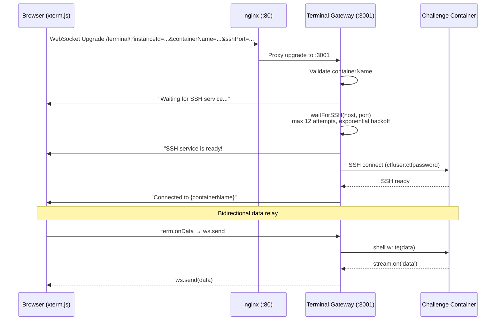

# Terminal Gateway

**Base path:** `ctf-terminal/`
**Port:** 3001
**Framework:** Express 4 + ws (WebSocket) + ssh2

---

## Architecture



## Connection Flow

1. **Frontend** connects WebSocket to `ws://host/terminal/` with query params:
   - `instanceId` — UUID of the challenge instance
   - `containerName` — Docker container name (required)
   - `sshPort` — Mapped host SSH port

2. **nginx** proxies to terminal gateway at `127.0.0.1:3001` with WebSocket upgrade headers.

3. **Gateway validates**: rejects with `"No container name specified"` if missing.

4. **SSH readiness check**: `waitForSSH()` loops up to 12 attempts with exponential backoff (2s, 3s, 4.5s... capped at 10s, ~60s total max).

5. **SSH connection**: `connectSSHWithRetry()` — up to 3 retries, 10s timeout per attempt.

6. **Terminal established**: bidirectional relay between WebSocket and SSH shell.

## SSH Configuration

| Parameter | Value |
|-----------|-------|
| Username | `ctfuser` |
| Password | `ctfpassword` |
| Port | 22 (container) / mapped host port |
| Terminal type | `xterm-256color` |
| Ready timeout | 10s |

## Health Check

```bash
curl http://localhost:3001/health
# { "status": "ok", "connections": 3 }
```

## Environment Variables

| Variable | Default | Description |
|----------|---------|-------------|
| `PORT` | `3001` | HTTP/WS listen port |

## Frontend Terminal URL

The frontend embeds the terminal WebSocket URL at build time via `NEXT_PUBLIC_TERMINAL_URL`.

For HTTP-only deployments (current):
```
NEXT_PUBLIC_TERMINAL_URL=ws://inno1-bif3-p1-w25.cs.technikum-wien.at/terminal
```

For future HTTPS deployments:
```
NEXT_PUBLIC_TERMINAL_URL=wss://inno1-bif3-p1-w25.cs.technikum-wien.at/terminal
```

## Container DNS Resolution

The gateway resolves containers via:
- If `sshPort` is provided: connects to `127.0.0.1:<sshPort>` (mapped host port)
- If `sshPort` is omitted: connects to `<containerName>:22` (Docker network DNS)

For containers on the `ctf-isolated` network, the gateway can resolve container names via the embedded Docker DNS resolver.
